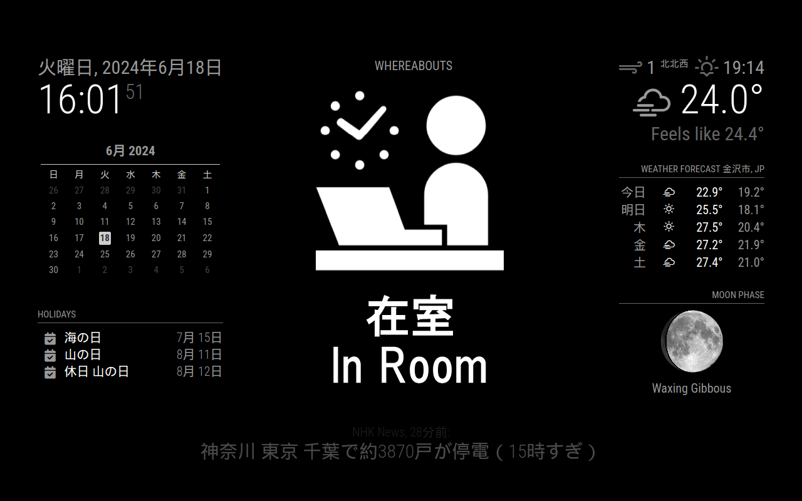
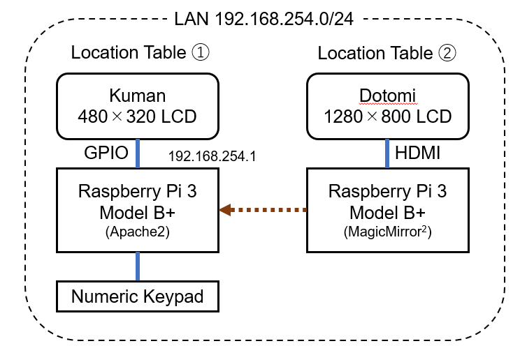

# ラズベリーパイを使ったデジタルサイネージ所在表

 [MyLocation](https://github.com/arumami88/MyLocation.git) で作成したデジタル所在表に追加するスタイリッシュな所在表です。
[MagicMirror<sup>2</sup>](https://magicmirror.builders/) によって，サイネージ風に時刻や天気予報と同時に所在を表示します。
また，ネットワークを通して [MyLocation](https://github.com/arumami88/MyLocation.git) で作成したデジタル所在表と連携します。
※区別のために，ここでは [MyLocation](https://github.com/arumami88/MyLocation.git) で作成したものを **「所在表①」** ，今回追加するものを **「所在表②」** と呼ぶことにします。



## 使用機器

| 種類 | 名称 |
| --- | --- |
| マイコン | Raspberry Pi 3 Model B+ |
| ディスプレイ | Dodomi 10.1インチモニタ（HDMI,1280×800)）|

## 構成図


所在表①をWebサーバとし，画面表示と同期してトップページ（所在表示）を更新する。
所在表②では所在表①のトップページを定期的に参照して所在を表示する。

## 設定手順

## 所在表①の作成と設定

## 1. 室内向け（制御用）所在表の作成

 [MyLocation](https://github.com/arumami88/MyLocation.git) の所在表①を作成する。

## 2. 所在表①のRaspberry Pi で，リポジトリをクローン
```
cd ~
git clone https://github.com/arumami88/MyLocation2.git
```

## 3. Webサーバの設定（ユーザーが arumami88 の例）
- Apache2 のインストール
```
sudo apt-get install apache2
```
インストールの確認
```
apache2 -v
```

- `/etc/apache2/site2-available/000-default.conf` の編集
```
...
DocumentRoot /home/arumami88/www
...

```

- `/etc/apache2/apache2.conf` の編集
```
...
<Directory /home/arumami88/www/>
    Options Indexes FollowSymLinks
    AllowOverride None
    Require all granted
</Directory>
...

```

- `/etc/apache2/envvars` の編集
```
...
export APACHE_RUN_USER=arumami88
export APACHE_RUN_GROUP=arumami88
...

```

- HTML ファイルの設置
```
cp -R ~/MyLocation2/www ~/

```

- 所在変更用スクリプト [whereabout2.py](whereabout2.py)を自分の仕様に合わせて編集する。
※[arumami88] を自身のユーザー名に変更


- 所在変更用スクリプトの入れ替える。
```
cp ~/MyLocation2/whereabout2.py ~/MyLocation/whereabout.py
```

- 再起動して動作確認する。

## 所在表②の作成

## 4. Raspberry Pi のOSインストールと初期設定

- [公式ページ](https://www.raspberrypi.com/software/) から **Raspberry Pi Imager** をダウンロードしてPCにインストール。
- Raspberry Pi Imagerを起動して，MicroSD カードにOSを書き込む。**Raspberry Pi OS (Legacy, 32-bit)** を選択。
- Raspberry Pi に MicroSD を差し込み，起動して初期設定。**Wi-Fiの設定** をして **ソフトウェアの更新** をして再起動。

## 5. 自動スリープを無効化・SSHの有効化

- デスクトップ左上のラズパイのロゴをクリック
- [設定]→[Raspberry Piの設定]→[ディスプレイ]タブ→[**画面のブランク**]をオフ
- [設定]→[Raspberry Piの設定]→[インターフェース]タブ→[**SSH**]をオン
- Raspberry Pi のIPアドレスを調べておく。
```
ifconfig | grep inet
```
- 再起動して有効化する。

## 5. Magic Mirror<sup>2</sup> のインストールと初期設定

- Node.js のインストール
```
curl -fsSL https://deb.nodesource.com/setup_20.x | sudo bash -
sudo apt-get install -y nodejs
```

- MagicMirror<sup>2</sup>のインストール
```
git clone https://github.com/MichMich/MagicMirror.git
```

- MagicMirror<sup>2</sup>の設定と実行[^1]
```
cd ~/MagicMirror
sudo npm run install-mm
sudo npm install -g npm@10.8.1
cp config/config.js.sample config/config.js
npm run start
```
画面が表示されればインストール成功。一旦 **CTRL + q** で終了。

[^1]: npm の更新は画面に表示される内容に従ってください。

## 6. OpenWeatherMapから気象情報を取得

- [OpenWeatherMap](https://openweathermap.org/) にアクセスする。
- ユーザ名，メールアドレス，パスワードを入力して，アカウント作成する。
- 初回は地域とAPIの使用目的が聞かれるので回答する。
- 本人確認メールが届くので，承認する。
- アカウントメニューの My API keys で自分のAPI key を確認できる。
- 表示したい地域の Location ID は [ここ](http://bulk.openweathermap.org/sample/city.list.json.gz) で調べられる。例えば石川県金沢市の Location ID は 1860243 になる。

## 7. MagicMirror<sup>2</sup>の設定 [~/MagicMirror/config/config.js](config.js)

- 日本語の設定とログの無効化
```
language: "ja"
locale: "ja-JP.UTF-8"
logLevel: []
```

- 標準カレンダーモジュールを日本の休日に変更
```
{
module: "calendar",
    header: "Holidays",
    position: "top_left",
    config: {
        calendars: [
            {
                fetchInterval: 7 * 24 * 60 * 60 *1000,
                symbol: "calendar-check",
                url: "https://www.google.com/calendar/ical/ja.japanese%23holiday%40group.v.calendar.google.com/public/basic.ics",
                maximumEntries: 3,
             }
         ],
         fade: false
    }
},
```

- 誉め言葉モジュールの表示を無効化
```
{
    module: "compliments",
    disabled: true,
    position: "lower_third"
},
```

天気予報モジュールは金沢市に変更 [^2]
```
{
    module: "weather",
    position: "top_right",
    config: {
        weatherProvider: "openweathermap",
        type: "current",
        location: "Kanazawa",
        locationID: "1860243",
        apiKey: "XXXXXXXX"
    }
},
{
    module: "weather",
    position: "top_right",
    header: "Weather Forecast",
    config: {
        weatherProvider: "openweathermap",
        type: "forecast",
        location: "Kanazawa",
        locationID: "1860243",
        apiKey: "XXXXXXXX"
    }
},
```
[^2]: APIキーは取得したものを記述してください。

### 11. 完成

- HDMIで作業をしていたら3.5インチモニタに表示を切り替える。
- 電源を切り，不要なマウス・キーボードを外す。（入力デバイスが変更されないか注意）
- 適切な場所に設置して起動し，動作確認して完了。

## コメント

- 設定後のネットワーク接続は不要となります。
- 手持ちの関係で使用機器を選びましたが，電子ペーパーや Raspberry Pi Zero などを使ってもいいですね。

## 参考

- 所在表示用の画像には [ICOON MONO](https://icooon-mono.com/) さんのアイコンを使用させていただきました。

- 作成には [uepon日々の備忘録 【RaspberryPi】WEBサイネージ化してみる（縦向きモニタ編）](https://uepon.hatenadiary.com/entry/2021/03/11/004116) などを参考にさせていただきました。