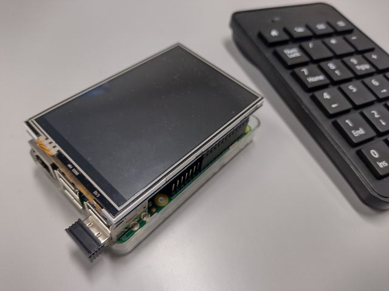

# ラズベリーパイを使ったデジタル所在表



## 使用機器

| 種類 | 名称 |
| --- | --- |
| マイコン | Raspberry Pi 3 Model B+ |
| ディスプレイ | Kumen 3.5インチモニタ（GPIO, 480x329）|
| 入力機器 | 無線テンキー（2.4G Hz）[^1]|

[^1]:単純に有線接続や Bluetooth 接続のキーボードを用いてもよい。

## 設定手順

## 1. Raspberry Pi のOSインストールと初期設定

- [公式ページ](https://www.raspberrypi.com/software/) から **Raspberry Pi Imager** をダウンロードしてPCにインストール。
- Raspberry Pi Imagerを起動して，MicroSD カードにOSを書き込む。**Raspberry Pi OS (Legacy, 32-bit)** を選択。
- Raspberry Pi に MicroSD を差し込み，起動して初期設定。**Wi-Fiの設定** をして **ソフトウェアの更新** をして再起動。

## 2. 自動スリープを無効化・SSHの有効化

- デスクトップ左上のラズパイのロゴをクリック
- [設定]→[Raspberry Piの設定]→[ディスプレイ]タブ→[**画面のブランク**]をオフ
- [設定]→[Raspberry Piの設定]→[インターフェース]タブ→[**SSH**]をオン[^2]
- Raspberry Pi のIPアドレスを調べておく。[^2]
```
ifconfig | grep inet
```
- 再起動して有効化する。

[^2]:SSHによるログインが必要な場合のみ。

## 3. このリポジトリをクローン
```
cd ~
git clone https://github.com/arumami88/MyLocation.git
```

## 4. Kuman 3.5インチLCDの設定

- LDC-show をインストール（※goodtft版は動作せず）
```
cd ~
git clone https://github.com/waveshare/LCD-show.git
chmod -R 755 LCD-show
cd LCD-show
./LCD35-show
```
実行すると自動的に再起動して3.5インチLCD表示に切り替わる。

- HDMI表示に戻すには下記コマンドを実行する。
```
cd ~/LCD-show
./LCD-hdmi
```
ある程度の作業が完了するまで，大画面のHDMIディスプレイで作業する方が楽。

## 5. 表示切替用キーの設定

- テンキーを接続して，デバイスの確認。
```
cat /proc/bus/input/devices
```
下記のコマンドで接続前後の差分を確認してもよい。増えたものが接続デバイス。
```
ls /dev/input
```

- evdev のインストールと動作確認
```
sudo pip3 install evdev
```
#### 動作確認用のテストコード（接続デバイスが **/dev/input/event0** の例）[buttontest.py](buttontest.py)
```
import evdev

device = evdev.InputDevice('/dev/input/event0')
for event in device.read_loop():
	if event.type == evdev.ecodes.EV_KEY:
		if event.value == 0:
			print(event.code, evdev.ecodes.KEY[event.code])
```
表示と関連付けるキーコード番号とコード名を確認しておく。

## 6. Chromium の自動操作（Selenium）の設定

- Selenium のインストール
```
pip install selenium
```

- Chromium のドライバをインストール
```
sudo apt install chromium-chromedriver
```

- ドライバのパスを確認（特に設定を変更していなければ /usr/bin/chromedriver）
```
which chromedriver
```
- Chromium のアップデート
```
sudo apt-get dist-upgrade chromium-browser
```

#### 動作確認用のテストコード（Kioskモードでの google ページの表示）[chrometest.py](chrometest.py)
```
from selenium import webdriver
from selenium.webdriver.chrome.options import Options
from selenium.webdriver.chrome.service import Service

options = Options()
options.add_argument('--kiosk')
options.add_experimental_option('excludeSwitches', ['enable-automation'])
options.binary_location = ('/usr/bin/chromium-browser')
service = Service('/usr/bin/chromedriver')
driver = webdriver.Chrome(options=options, service=service)
driver.get('https://google.com')
```

## 7. 数字キーの押下による所在変更の確認
```
cd ~/MyLocation
python whereabout.py
```
- 所在変更用サンプルコード [whereabout.py](whereabout.py) を実行して数字キーの押下で表示変更されるか確認する。

#### サンプルコードの設定内容

- サンプルコードの下記の表のように設定されているので，好みに合わせて変更する。

| 種別 | 設定値 |
| --- | ---|
| 入力デバイス | /dev/input/event0 |
| 所在表示用HTML | file:///home/arumami88/MyLocation/html/[^3] |
| 初期値 | 帰宅 (home.html) |
| 数字9キー | 食事 (meal.html) |
| 数字8キー | ブランク (blank.html) |
| 数字7キー | 在室 (room.html) |
| 数字6キー | 会議 (meeting.html) |
| 数字5キー | ブランク (blank.html) |
| 数字4キー | 一時離席 (afk.html) |
| 数字3キー | 出張 (trip.html) |
| 数字2キー | ブランク (blank.html) |
| 数字1キー | 休暇 (vacation.html) |
| 数字0キー | 帰宅 (home.html) |
| ENTERキー | オフモード (blank.html) |

[^3]:参照できるディレクトリを絶対PATHで記述する。

## 8. マウスカーソルの消去

- Unclutter をインストールする。
```
sudo apt-get install unclutter
```
再起動後に有効となる。詳細な設定は `/etc/default/unclutter` を修正する。

## 9. 自動起動の設定

- 起動スクリプトのサンプル [mylocation.service](mylocation.service)の修正する。
※[arumami88] を自身のユーザー名に変更

- /etc/systemd/system にコピー
```
sudo cp ~/MyLocation/mylocation.service /etc/systemd/system/
```

- 起動テスト
```
sudo systemctl start mylocation.service
```

- 自動起動の設定
```
sudo systemctl enable mylocation.service
```

### 10. 夜間ブランクスクリーンの設定

- スクリーンセーバーの有効化／無効化用スクリプト[saveron.sh](saveron.sh)，[saveroff.sh](saveroff.sh)に実行属性を付与する。
```
chmod 755 saveron.sh saveroff.sh
```

- 定期実行するように `/etc/crontab` を下記のように編集する。

環境変数の設定を上部に追加
```
DISPLAY=:0.0
XAUTHORITY=/home/arumami88/.Xauthority
```
定時動作の記述
```
0 23    * * *    root    /home/imamura/MyLocation/saveron.sh
0 5     * * *    root    /home/imamura/MyLocation/saveroff.sh
```
※例は夜23時にスクリーンセーバーを有効化し，朝5時に無効化する。

### 11. 完成

- HDMIで作業をしていたら3.5インチモニタに表示を切り替える。
- 電源を切り，不要なマウス・キーボードを外す。（入力デバイスが変更されないか注意）
- 適切な場所に設置して起動し，動作確認して完了。

## コメント


## 参考

- 所在表示用の画像には [ICOON MONO](https://icooon-mono.com/) さんのアイコンを使用させていただきました。

- 作成には [uepon日々の備忘録 【RaspberryPi】WEBサイネージ化してみる（縦向きモニタ編）](https://uepon.hatenadiary.com/entry/2021/03/11/004116) などを参考にさせていただきました。