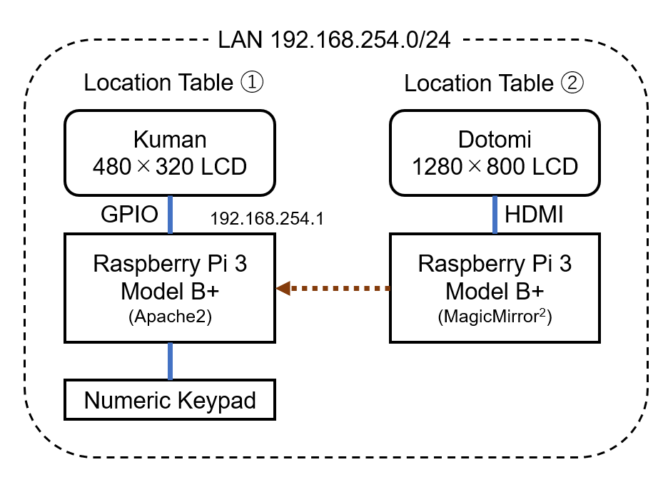

# ラズベリーパイを使ったデジタルサイネージ所在表

[MyLocation](https://github.com/arumami88/MyLocation.git) で作成したデジタル所在表に追加するスタイリッシュな所在表です。
[MagicMirror<sup>2</sup>](https://magicmirror.builders/) によって，サイネージ風に時刻や天気予報と同時に所在を表示します。
また，ネットワークを通して [MyLocation](https://github.com/arumami88/MyLocation.git) で作成したデジタル所在表と連携します。
区別のために，ここでは [MyLocation](https://github.com/arumami88/MyLocation.git) で作成したものを **「所在表①」** ，今回追加するものを **「所在表②」** と呼ぶことにします。
所在表①が室内の操作者向けの表示として，所在表②が室外の来訪者向けを想定しています。


## 使用機器

| 種類 | 名称 |
| --- | --- |
| マイコン | Raspberry Pi 3 Model B+ |
| ディスプレイ | Dodomi 10.1インチモニタ（HDMI,1280×800)）|

## 構成図


所在表①をWebサーバとし，画面表示と同期してトップページ（所在表示）を更新する。
所在表②では所在表①のトップページを定期的に参照して所在を表示する。

## 設定手順

## 所在表①の作成と設定

## 1. 室内向け（操作用）所在表の作成

 [MyLocation](https://github.com/arumami88/MyLocation.git) の所在表①を作成する。
 ※Webサーバにするため要ネットワーク接続

## 2. 所在表①の Raspberry Pi で，リポジトリのクローン
```
cd ~
git clone https://github.com/arumami88/MyLocation2.git
```

## 3. Webサーバを設定（ユーザーが arumami88 の例）
- Apache2 をインストールする。
```
sudo apt-get install apache2
```
インストールできたか確認する。
```
apache2 -v
```

- `/etc/apache2/site2-available/000-default.conf` を編集する。
```
...
DocumentRoot /home/arumami88/www
...

```

- `/etc/apache2/apache2.conf` を編集する。
```
...
<Directory /home/arumami88/www/>
	Options Indexes FollowSymLinks
	AllowOverride None
	Require all granted
</Directory>
...

```

- `/etc/apache2/envvars` を編集する。
```
...
export APACHE_RUN_USER=arumami88
export APACHE_RUN_GROUP=arumami88
...

```

- 所在表②用の所在表示 HTML ファイルを設置する。
```
cp -R ~/MyLocation2/www ~/

```

- 所在変更用スクリプト [whereabout2.py](whereabout2.py)を自分の仕様に合わせて編集する。
※[arumami88] を自身のユーザー名に変更


- 所在変更用スクリプトを入れ替える。
```
cp ~/MyLocation2/whereabout2.py ~/MyLocation/whereabout.py
```

- 再起動して動作確認する。

## 所在表②の作成

## 4. Raspberry Pi のOSインストールと初期設定

- [公式ページ](https://www.raspberrypi.com/software/) から Raspberry Pi Imager をダウンロードしてPCにインストールする。
- Raspberry Pi Imagerを起動して，MicroSD カードにOSを書き込む。Raspberry Pi OS (Legacy, 32-bit)を選択する。
- Raspberry Pi に MicroSD を差し込み，起動して初期設定する。Wi-Fiの設定とソフトウェアの更新をして再起動する。

## 5. 自動スリープを無効化・SSHの有効化

- デスクトップ左上のラズパイのロゴをクリックする。
- [設定]→[Raspberry Piの設定]→[ディスプレイ]タブ→[画面のブランク]をオフにする。
- [設定]→[Raspberry Piの設定]→[インターフェース]タブ→[SSH]をオンにする。
- 今後のために，Raspberry Pi のIPアドレスを確認しておく。
```
ifconfig | grep inet
```
- 再起動して有効化する。

## 5. Magic Mirror<sup>2</sup> のインストールと初期設定

- Node.js のインストール
```
curl -fsSL https://deb.nodesource.com/setup_20.x | sudo bash -
sudo apt-get install -y nodejs
```

- MagicMirror<sup>2</sup>のインストール
```
git clone https://github.com/MichMich/MagicMirror.git
```

- MagicMirror<sup>2</sup>の設定と実行[^1]
```
cd ~/MagicMirror
sudo npm run install-mm
sudo npm install -g npm@10.8.1
cp config/config.js.sample config/config.js
npm run start
```
画面が表示されればインストール成功。一旦 **CTRL + q** で終了する。

[^1]: npm の更新は画面に表示される内容に従う。

## 6. OpenWeatherMapから気象情報を取得

- [OpenWeatherMap](https://openweathermap.org/) にアクセスする。
- ユーザ名，メールアドレス，パスワードを入力して，アカウント作成する。
- 初回は地域とAPIの使用目的が聞かれるので回答する。
- 本人確認メールが届くので，承認する。
- アカウントメニューの My API keys で自分のAPI key を確認できる。
- 表示したい地域の Location ID は [ここ](http://bulk.openweathermap.org/sample/city.list.json.gz) で調べられる。例えば石川県金沢市の Location ID は 1860243 になる。

## 7. MagicMirror<sup>2</sup>の設定

- `~/MagicMirror/config/config.js` を編集する。

設定ファイル [cofig.js](config.js) 例を下記のカスタマイズ内容を参考に編集して，コピーしてもよい。
```
cd ~/MyLocation2/config.js ~/MagicMirror/config/config.js
```

### カスタマイズ内容

- 日本語の設定とログの無効化する。
```
language: "ja"
locale: "ja-JP.UTF-8"
logLevel: []
```

- 標準カレンダーモジュールを日本の休日に変更する。
```
		{
		module: "calendar",
		header: "Holidays",
		position: "top_left",
		config: {
			calendars: [
				{
					fetchInterval: 7 * 24 * 60 * 60 *1000,
					symbol: "calendar-check",
					url: "https://www.google.com/calendar/ical/ja.japanese%23holiday%40group.v.calendar.google.com/public/basic.ics",
					maximumEntries: 3,
				}
			],
			fade: false
		}
	},
```

- 誉め言葉モジュールの表示を無効化する。
```
	{
		module: "compliments",
		disabled: true,
		position: "lower_third"
	},
```

- 天気予報モジュールは好きな地域に変更する。（例では金沢市） [^2]
```
	{
		module: "weather",
		position: "top_right",
		config: {
			weatherProvider: "openweathermap",
			type: "current",
			location: "Kanazawa",
			locationID: "1860243",
			apiKey: "XXXXXXXX"
		}
	},
	{
		module: "weather",
		position: "top_right",
		header: "Weather Forecast",
		config: {
			weatherProvider: "openweathermap",
			type: "forecast",
			location: "Kanazawa",
			locationID: "1860243",
			apiKey: "XXXXXXXX"
		}
	},
```
[^2]: APIキーは取得したものを記述してください。

- ニュースフィードモジュールはNHK主要ニュースに変更する。
```
	{
		module: "newsfeed",
		position: "top_bar",
		config: {
			feeds: [
				{
					title: "NHK News",
					url: "https://www.nhk.or.jp/rss/news/cat0.xml"
				}
			],
			showSourceTitle: true,
			showPublishDate: true,
			broadcastNewsFeeds: true,
			broadcastNewsUpdates: true
		}
	},
```
### 8. モジュールの追加

- マンスリーカレンダーモジュールを追加する。
```
cd ~/MagicMirror/modules/
git clone https://github.com/KirAsh4/calendar_monthly.git
```
`config/config.js` に下記の記述を追加する。
```
	{
	module: "calendar_monthly",
	position: "top_left",
	},
```

- 月齢モジュールを追加する。
```
cd ~/MagicMirror/modules/
git clone https://github.com/NolanKingdon/MMM-MoonPhase.git
```
`config/config.js` に下記の記述を追加する。
```
	{
		module: "MMM-MoonPhase",
		position: "top_right",
		config: {
			updateInterval: 43200000,
			hemisphere: "N",
			resolution: "detailed",
			basicColor: "white",
			title: true,
			phase: true,
			size: 100,
			moonAlign: "center",
			textAlign: "center",
			alpha: 0.7,
			riseAndSet: {
				display: false,
				lon: -80.0,
				lat: 40.0,
				gmtOffset: -3.0
			}
		}
	},
```

### 9. 所在表示の追加

- Webページ表示モジュールを追加する。[^3]
```
cd ~/MagicMirror/modules/
git clone https://github.com/AgP42/MMM-SmartWebDisplay.git
```
`config/config.js` に下記の記述を追加する。
```
	{
		module: "MMM-SmartWebDisplay",
		position: "middle_center",
		config: {
			logDebag: false,
			height: "500px",
			width: "500px",
			updateInterval: 0.5,
			displayLastUpdate: false,
			url: [http://192.168.254.1/],
			scrolling: "no",
		},
	},
```
[^3]: URLは所在表①のIPアドレスを指定する。

- テキスト表示モジュールを追加する。
```
cd ~/MagicMirror/modules/
git clone https://github.com/SaltyRiver/MMM-SimpleText.git
```
`config/config.js` に下記の記述を追加する。
```
	{
		module: "MMM-SimpleText",
		position: "top_center",
		config: {
			text: {
			  'value': 'WHEREABOUTS'
			},
		},
	},
```

### 10. 自動起動の設定

- pm2 をインストールする。
```
sudo npm install -g pm2
```

- 自動起動するように設定する。
```
pm2 startup
cp ~/MagicMirror/installers/mm.sh ~/
pm2 start mm.sh
```
※ 自動起動するようになるので，CTRL + q で終了しつつ素早く入力する。
※ 下記の[arumami88] の部分は自身のユーザー名に変更する。
```
pm2 save
pm2 delete 0
pm2 startup
sudo env PATH=$PATH:/usr/bin /usr/lib/node_modules/pm2/bin/pm2 startup system -U arumami88 –h /home/arumami88
sudo systemctl enable pm2-arumami88.service
```

### 11. 完成

- 電源を切り，不要なマウス・キーボードを外す。
- 適切な場所に設置して起動し，動作確認して完了。

## コメント

- MMM-SmartWebDisplay モジュールは一定時間（設定例では30秒）毎にページが更新されるはずですが、数時間経っても更新されない現象が起こります。
現在、1日1回定期的に再起動して対応しています。`pm2 restart mm` を定期的に実行してもよいかもしれません。
## 参考

- 所在表示用の画像には [ICOON MONO](https://icooon-mono.com/) さんのアイコンを使用させていただきました。

- 作成には [マジックミラーが無くても情報表示にMagicMirror²を使う](https://raspida.com/magicmirror-for-info-board/) などを参考にさせていただきました。